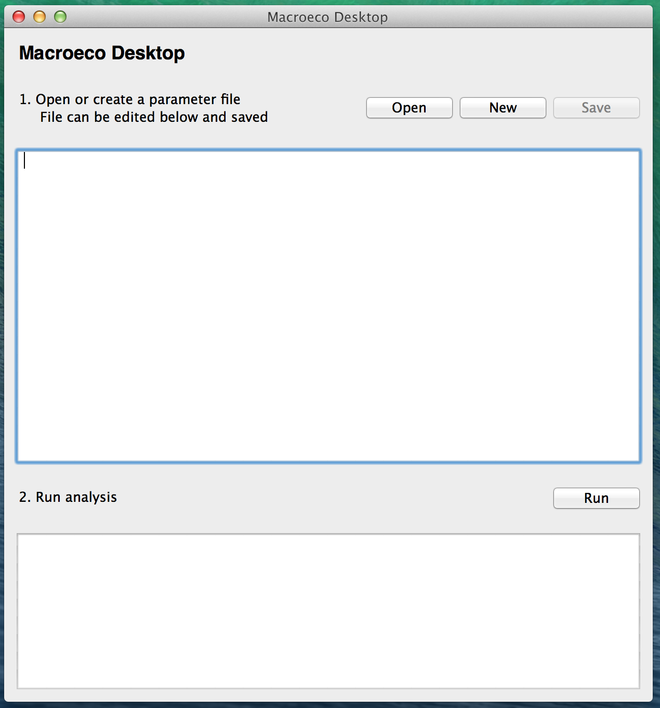
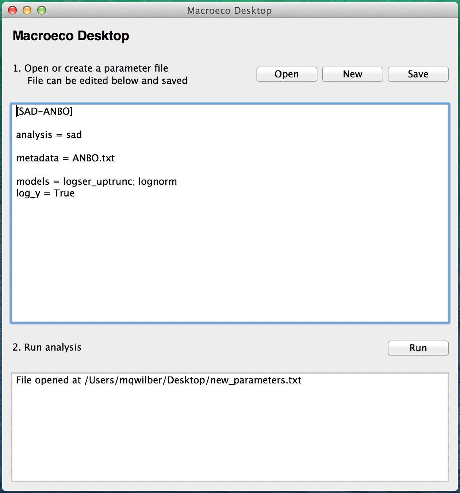
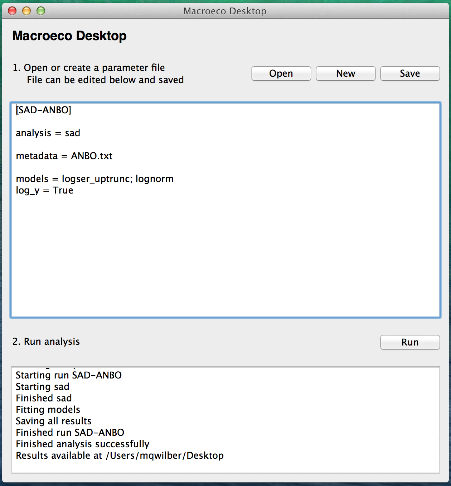
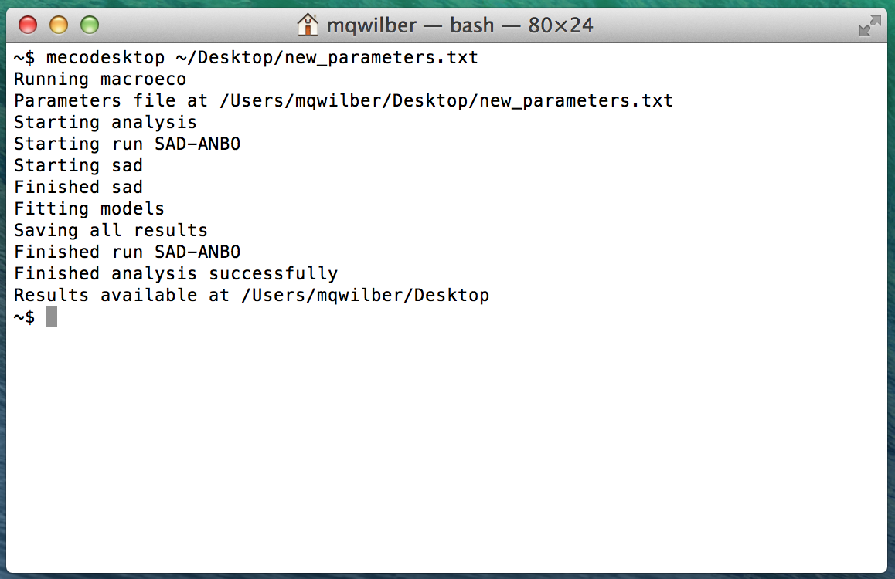
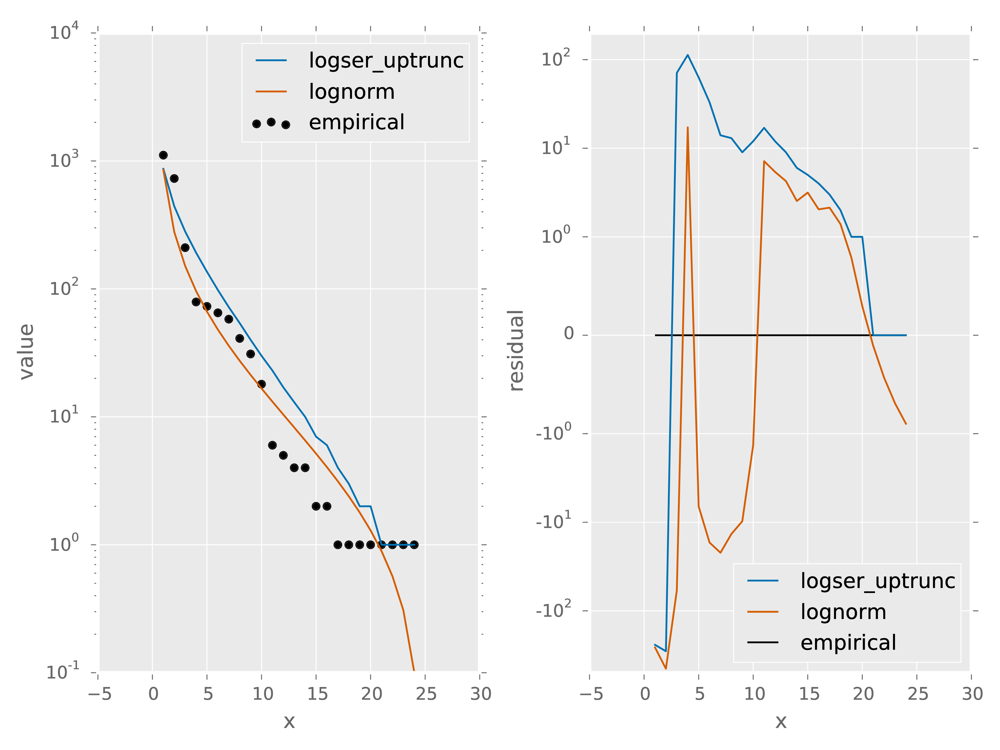

===============
Getting Started
===============

This tutorial provides an introduction to the basic use of Macroeco for ecological pattern analysis.

The functionality of the software Macroeco can be accessed through two interfaces: the low-level Python package ``macroeco`` or the high-level MacroecoDesktop interface.

The Python package ``macroeco`` is a scientific Python package that can be imported into a user's custom scripts and modules along with other scientific packages such as ``scipy`` or ``pandas``.

The MacroecoDesktop interface is designed for users who wish to use the functionality of Macroeco but are not Python programmers. Instead of writing Python code, users of MacroecoDesktop create simple text files, known as parameters files, that describe an analysis and the type of desired output. MacroecoDesktop provides both a window-based graphical interface and a "headless" command line mode - the latter of these allows MacroecoDesktop to be called from other computing environments such as R.

.. _installation:

Installation
============

For users with an existing scientific Python environment, the latest stable version of both ``macroeco`` and the MacroecoDesktop interface can be installed with ``pip install macroeco``. Several package dependencies may also be installed by this command. The latest development version of Macroeco can be found in the "develop" branch of the `Macroeco GitHub repo <http://github.com/jkitzes/macroeco/>`_.

Mac OS X users who wish only to use MacroecoDesktop can instead download the MacroecoDesktop application from `this link <https://github.com/jkitzes/macroeco/releases>`_. After unzipping, drag the MacroecoDesktop application into the Applications folder.

Windows and Linux users who wish to use MacroecoDesktop will need to set up a scientific Python environment. The developers recommend the free `Continuum Anaconda <https://store.continuum.io/cshop/anaconda/>`_ scientific Python installation for new users. After downloading and installing Anaconda, run the command ``pip install macroeco`` from a Terminal window.

The remainder of this tutorial uses demo data from a vegetation census in Anza-Borrego Desert State Park in southern California. This demo data can be downloaded at `this link <https://github.com/jkitzes/macroeco/releases>`_. The file ANBO.csv contains the census data and the file ANBO.txt contains metadata describing the data table. This data may be freely shared and used for analysis so long as credit is given to the authors.

.. _first-steps-macroeco:

First steps: ``macroeco``
=========================

Users of MacroecoDesktop should skip this section and proceed below to :ref:`first-steps-macroeco-desktop`.

The ``macroeco`` package contains three main subpackages of interest:

* Empirical - loads data tables and performs empirical analysis of macroecological metrics, such as the species abundance distribution and species area relationship

* Models - provides objects for distributions and curves predicted by macroecological theory, such as the logseries distributions and power law function

* Compare - provides utility functions for comparing the fit of models to empirical metrics, such as AIC weights and r-squared statistics

A common workflow involves loading data, calculating an empirical metric, fitting one or more models to the empirical metric, and evaluating the fit of the model to the metric. The following example calculates a simple species abundance distribution for the demo data.

First, the ``Patch`` class from the empirical subpackage is used to create a Patch object that holds the data table and a metadata dictionary describing the data. ``Patch`` requires a path, absolute or relative, to a metadata file as a mandatory argument (see :ref:`own-data` for information on creating a metadata file for a new data set).

    >>> import macroeco as meco
    >>> pat = meco.empirical.Patch('~/Desktop/demo/ANBO.txt')

The empirical subpackage contains a number of functions that operate on patch objects and return macroecological metrics. Here we'll use the function ``sad`` to calculate a species abundance distribution. The first argument is the patch object to use, the second is a string specifying which column has the species names (spp_col) and which, if any, has a count of individuals at a particular location (count_col), and the third is a string specifying how to split the data (see the Reference guide for the functions in the empirical module for more information on input arguments).

    >>> sad = meco.empirical.sad(pat, 'spp_col:spp; count_col:count', '')

All functions for macroecological metrics return their results as a list of tuples. Each tuple has two elements: a string describing how the data were split and a result table with a column ``y`` (for univariate distributions like the species abundance distribution) or columns ``y`` and ``x`` (for curves such as a species area relationship) giving the results of the analysis. Since the data were not split in this example, the list has only one tuple.

Any number of distributions from the models subpackage can be fit to the resulting empirical metric. The code below fits the two parameters of the LINK upper truncated logseries distribution and uses the function ``AIC`` from the compare subpackage to calculate the AIC for this distribution and data.

    >>> p, b = meco.models.logser_uptrunc.fit_mle(sad[0][1]['y'])
    >>> p, b
    (0.9985394369365049, 2445.0)
    >>> meco.compare.AIC(sad[0][1]['y'], meco.models.logser_uptrunc(p, b))
    208.61902087378027

The two fitted parameters can be used to generate a rank abundance distribution of the same length as the empirical data. The empirical and predicted rank curves are plotted.

    >>> import numpy as np
    >>> import matplotlib.pyplot as plt
    >>> plt.semilogy(meco.models.logser_uptrunc.rank(len(sad[0][1]),p,b)[::-1])
    >>> plt.semilogy(np.sort(sad[0][1]['y'])[::-1])
    >>> plt.show()

For information on performing more complex analyses using ``macroeco``, see :ref:`using-macroeco`.

.. _first-steps-macroeco-desktop:

First steps: MacroecoDesktop
=============================

This section describes the MacroecoDesktop interface. Mac OS X users who have downloaded the MacroecoDesktop standalone application will have a choice between accessing MacroecoDesktop through a graphical program or at the command line. Other users will only have access to MacroecoDesktop through the command line interface. Both methods of interaction are described below.

The purpose of MacroecoDesktop is to provide non-programmers an interface for accessing the functionality of Macroeco without the need to write Python code. Instead, the user creates a text file, called a parameters file, that contains the information and instructions needed by MacroecoDesktop to execute an analysis.

This section gives a very brief overview of how to create a simple parameter file and use it to analyze a species abundance distribution (the analysis and output are identical to that shown above in :ref:`first-steps-macroeco`). More information on the structure of parameter files and how to customize them can be found in the tutorial :ref:`recipes`.

To create a simple parameter file, open a text editor of your choice. Windows users can use Notepad, which can be accessed through the Start Menu. Mac users can use the program TextEdit, which is located in Utilities folder inside of the Applications folder.

**IMPORTANT**: Mac users who use TextEdit should open the program and immediately go to the Format menu and select the option Make Plain Text. This will need to be done every time TextEdit is used to create a new document. Alternatively, you might wish to download a better text editor such as the free program `TextWrangler <http://www.barebones.com/products/textwrangler/>`_.

To get started, type the following text into your text editor. Save this file with the name `new_parameters.txt` in the demo directory containing the ANBO.txt and ANBO.csv files. ::

    [SAD-ANBO]

    analysis = sad

    metadata = ANBO.txt

    models = logser_uptrunc; lognorm
    log_y = True

A single parameter file can contain multiple "runs", each of which is denoted by the name of the run written in brackets (this run is titled `SAD ANBO`, as it will analyze the species abundance distribution for the Anza-Borrego demo data).

Conceptually, the information required for a single run can be broken down into three parts. The first part tells MacroecoDesktop the type of analysis that's desired, in this case a species abundance distribution (any function contained in the empirical or models subpackage of ``macroeco`` can be listed here as an analysis).

The second part contains the information that MacroecoDesktop needs to complete the core analysis. To generate an empirical species abundance distribution, the necessary inputs are the location of a metadata file that both points to a data table and provides information about the data and a variable called "cols" that tells MacroecoDesktop which column in the data table represents the name of the species and which (if any) gives the count of individuals at a location.

The third part describes what, if any, theoretical models should be compared to the core empirical result and what options should be used for the comparison. The models variable gives a list of distribution names to compare to the empirical data. An additional variable log_y specifies that the y-axis of output graphs should be log transformed.

Once the parameter file has been created and saved, MacroecoDesktop can be called either from the graphical MacroecoDesktop program or from the Terminal.

For Mac users who have downloaded the standalone MacroecoDesktop application, double click to launch the program. You should see a screen that looks like this

Use the Open button near the top to find and open the `new_parameters.txt` file that you just created. The parameters file will appear, and it can be edited and saved here again if desired.

Once the parameter file is opened, click the Run button near the bottom. When the line "Finished analysis successfully" appears in the bottom window, the analysis is complete and the results are available. The results will be found in a folder named `results` in the same location as the `new_parameters.txt` file.

For users who wish to access MacroecoDesktop from the terminal and who have installed ``macroeco`` in their Python environment or clones the github repository and run `setup.py`, simply run the command ``mecodesktop path/to/new_parameters.txt``. Output about the analysis progress will be printed in the Terminal window, and the results will eventually be saved in a folder named `results` in the same location as the `new_parameters.txt` file.

Mac users who have downloaded the standalone MacroecoDesktop application can also access MacroecoDesktop from the command line if desired. Presuming that the MacroecoDesktop program has been placed in the Applications folder, the command to use is ``/Applications/MacroecoDesktop.app/Contents/MacOS/mecodesktop path/to/new_parameters.txt``

For information on performing more complex analyses using MacroecoDesktop, see :ref:`using-macroecodesktop`.

First steps: interpreting output
==========================================

All the results generated from the parameter file `new_parameters.txt` are stored in a folder named `results`. In general the `results` folder will contain a log file (`_log.txt`) as well some number of folders. Each folder corresponds to a particular run specified in the parameters file.

In the case of the analysis that we ran above the log file should be similar to the output you saw on the MacroecoDesktop GUI or the terminal window ::

    [2015/09/02 15:21:47 PM] {meco} INFO Running macroeco
    [2015/09/02 15:21:47 PM] {meco} INFO Parameters file at /Users/mqwilber/Desktop/new_parameters.txt
    [2015/09/02 15:21:47 PM] {meco} INFO Starting analysis
    [2015/09/02 15:21:47 PM] {meco} INFO Starting run SAD-ANBO
    [2015/09/02 15:21:47 PM] {meco} INFO Starting sad
    [2015/09/02 15:21:47 PM] {meco} INFO Finished sad
    [2015/09/02 15:21:47 PM] {meco} INFO Fitting models
    [2015/09/02 15:21:47 PM] {meco} INFO Saving all results
    [2015/09/02 15:21:48 PM] {meco} INFO Finished run SAD-ANBO
    [2015/09/02 15:21:48 PM] {meco} INFO Finished analysis successfully
    [2015/09/02 15:21:48 PM] {meco} INFO Results available at /Users/mqwilber/Desktop

The other folder in `results` should be named `SAD-ANBO` and it contains the results of the `SAD-ANBO` run specified in the `new_parameters.txt` file.

This folder contains 6 files

1. `_split_index.csv`: This file contains a DataFrame specifying the different splits performed in the analysis.  In this analysis, the ANBO data were not split in any way so the resulting csv file looks like

    +--+-------+
    |  | split |
    +==+=======+
    | 1|       |
    +--+-------+

  Where the 1 corresponds to the first split (which is blank) for this analysis. For information on splits see :doc:`empirical` or :ref:`a-more-complex-example`.

2. `1_core_result.csv`: This file contains the core result of the analysis for split 1. Because the file `new_parameter.txt` specified `analysis = sad` the core result is a species abundance distribution. `spp` gives the name of a species and `y` gives the abundance of that species.

    ====== =========
    spp    y
    ====== =========
    arsp1  2.0000
    cabr   31.0000
    caspi1 58.0000
    chst   1.0000
    comp1  5.0000
    cran   4.0000
    crcr   65.0000
    crsp2  79.0000
    enfa   1.0000
    gnwe   41.0000
    .      .
    ====== =========

3. `1_data_models.csv`: This file contains a comparison of the empirical species abundance distribution with the models specified in `new_parameters.txt` for the split 1. In this case `models = logser_uptrunc; lognorm`.

== ====== ========= ============== ======================= ======== ================
x  spp    empirical logser_uptrunc logser_uptrunc_residual lognorm  lognorm_residual
== ====== ========= ============== ======================= ======== ================
24 lesp1  1.0000    1.0000         0.0000                  0.1010   -0.8990
23 unsh1  1.0000    1.0000         0.0000                  0.3082   -0.6918
22 plsp1  1.0000    1.0000         0.0000                  0.5685   -0.4315
21 magl   1.0000    1.0000         0.0000                  0.8933   -0.1067
.  .      .         .              .                       .        .
4  crsp2  79.0000   192.0000       113.0000                96.2083  17.2083
3  phdi   210.0000  281.0000       71.0000                 151.1795 -58.8205
2  ticr   729.0000  443.0000       -286.0000               278.8781 -450.1219
1  grass  1110.0000 868.0000       -242.0000               850.8302 -259.1698
== ====== ========= ============== ======================= ======== ================

  `x` gives the rank of each species abundance with the most abundance species having a rank of 1. `spp` gives the species names, `empirical` gives the empirical species abundance distribution. `logser_uptrunc` gives the rank abundance distribution predicted by the best fit `logser_uptrunc` to the empirical data. `logser_uptrunc_residual` gives the residuals defined as `empirical` - `logser_uptrunc`. `lognorm` and `lognorm_residul` are defined similarly.

4. `1_data_models.pdf`: A plot of the information provided in `1_data_models.csv`

5. `1_fitted_params.csv`: The fitted parameters for `models = logser_uptrunc; lognorm` to the empirical species abundance distribution for split 1. A description of the different models and their parameters can be found at :doc:`models`

    ============== ================== ================
    Model           Fit Parameters
    ============== ================== ================
    logser_uptrunc 0.9985394369365049 2445.0
    lognorm        2.2268165055360067 2.2188336108431264
    ============== ================== ================

6. `1_test_statistics`: The AIC values (corrected AIC by default) for comparing the goodness of fit of the models specified in `models = logser_uptrunc; lognorm` to the empirical species abundance distribution for split 1.

    ============== ===========
    Model           AIC
    ============== ===========
    logser_uptrunc 208.61902087
    lognorm        217.82289264
    ============== ===========

