.. _using-macroeco:

==============
Using macroeco
==============

This tutorial describes the basic usage of the ``macroeco`` Python package. Users who wish to use the high-level MacroecoDesktop interface should refer to the :ref:`using-macroecodesktop` tutorial.  To start, load the following packages in your python environment

    >>> import macroeco as meco
    >>> import matplotlib.pyplot as plt
    >>> import numpy as np
    >>> plt.style.use('ggplot') # For pretty plotting

The `models` subpackage
============================

The `models` subpackage contains a number of common statistical distributions and curves used in macroecological analyses.  A full list of the available models and their documentation can be found at :doc:`models`.

    **Note**: When just using the `models` subpackage one will typically start with

        >>> import macroeco.models as md

    This will be sufficient for most users as it will import the core `models` of `macroeco`. However, if you want access to all the functions and classes used to build these models you can use the notation

        >>> import macroeco.models._distributions as dist
        >>> import macroeco.models._curves as curves

Distributions
-------------

All the statistical distributions contained in `models` inherit from the `rv_discrete` or `rv_continuous` classes defined in the package `scipy.stats.distributions`. Therefore, all the distribution can be used in the same way as any distributions defined in `scipy.stats`.  For example, a Fisher logseries distribution, a common distribution used for species abundance distributions, is defined by one parameter `p` which can take values between 0 and 1. This distribution could defined as follows

    >>> logser_dist = meco.models.logser(p=0.9)

The probability of observing a species with one individual is

    >>> logser_dist.pmf(1)
    0.39086503371292664

The probability of observing and species with 10 individuals or less (given by the cumulative distribution function) is

    >>> logser_dist.cdf(10)
    0.9201603889810761

Similarly, the following function call gives the same results as above

    >>> meco.models.logser.pmf(1, 0.9)
    0.39086503371292664
    >>> meco.models.logser.cdf(10, 0.9)
    0.9201603889810761

The distributions contained in the `models` package also contain some special functions such as `rank`, which gives the rank abundance distribution for a given distribution. For example, the rank abundance distribution for the logseries distribution given above with 30 species in the community is given by

    >>> meco.models.logser.rank(30, 0.9)
    array([  1.,   1.,   1.,   1.,   1.,   1.,   1.,   1.,   1.,   1.,   1.,
         1.,   2.,   2.,   2.,   2.,   2.,   3.,   3.,   3.,   4.,   4.,
         5.,   5.,   6.,   7.,   8.,  10.,  13.,  21.])

A community with 30 species following this logseries distribution is expected to have 15 species with one individual.

Curves
------

The `models` subpackage also contains objects known as `Curves`. These consist of macroecological curves such as species area relationships (SAR)s and endemic area relationships (EAR)s.  Currently, there are 7 implemented curves (:doc:`models`)

1. Power law curve
2. A general sampling SAR with direct upscaling or downscaling
3. A general sampling SAR with iterative upscaling or downscaling
4. A general sampling EAR with direct downscaling
5. Maximum Entropy Theory of Ecology (METE) SAR with direct upscaling and downscaling
6. METE SAR with iterative upscaling and downscaling
7. METE EAR with direct downscaling

The general sampling SAR/EAR is discussed in Kitzes and Harte (2014) (also see `sampling_sar`) and is a combination of a species abundance distribution (SAD) and a species-level spatial abundance distribution.  In `macroeco`, we implement the general sampling SAR/EAR with a flexible SAD (zero-truncated negative binomial distribution, `nbinom_ztrunc`) and a flexible SSAD (conditional negative binomial distribution, `cnbinom`) both are which are distributions defined within `macroeco.models`.  Each of these distributions has an aggregation parameter `k_agg` that that allows them to take the shapes of most realistically observed SADs and SSADs.

To use the general sampling SAR, you need to specify 4 parameters

1. The total number of species at some base areas (`S0`)
2. The total number of individuals in a community at some base area (`N0`)
3. The aggregation parameter of the SAD (`sad_k`)
4. The aggregation parameter of the SSAD (`ssad_k`)

For example, to estimate the expected number of species present in an area that is double the size of the base area and half the size of the base area given `S0 = 30`, `N0 = 1000`, and a Broken Stick SAD (`sad_k = 1`) and an approximately binomial SSAD (`ssad_k = 10`) we can use the following code

    >>> # Number of species in base area
    >>> S0 = 30

    >>> # Number of individuals in base area
    >>> N0 = 1000

    >>> # A list of habitat areas. Base area is 1
    >>> areas = [1, 2, 0.5]

    >>> # Get the non-iterative sampling SAR
    >>> meco.models.sampling_sar.vals(areas, S0, N0, sad_k=1, ssad_k=10, approx=True)
    array([ 30.        ,  30.50645744,  29.03925601])

    >>> # Get the iterative sampling SAR
    >>> meco.models.sampling_sar_iterative.vals(areas, S0, N0, sad_k=1, ssad_k=10, approx=True)
    array([ 30.        ,  30.50645744,  29.03925601])

For the parameter `areas`, the first number in the list (1 in this example) is *always* the base area (e.g. 50 ha, 2.5 m^2, 300 in^2), and the following numbers are additional areas at which to calculate species richness (2 and 0.5 in this example). Using the argument `approx=True` significantly speeds up the calculation and will tend to given very similar answers to `approx=False`. The default is `approx=True`.

Note that the iterative approach the non-iterative approach are not
generally the same

    >>> areas = [1, 0.5, 0.25, 0.125, 0.0625]
    >>> noiter_sar = meco.models.sampling_sar.vals(areas, S0, N0, 1, 1)
    >>> iter_sar = meco.models.sampling_sar_iterative.vals(areas, S0, N0, 1, 1)

    >>> # Plot the results
    >>> plt.plot(areas, noiter_sar, label="Non-iterative SAR")
    >>> plt.plot(areas, iter_sar, label="Iterative SAR")
    >>> plt.legend(loc="center right")
    >>> plt.xlabel("Area")
    >>> plt.ylabel("# of Species")

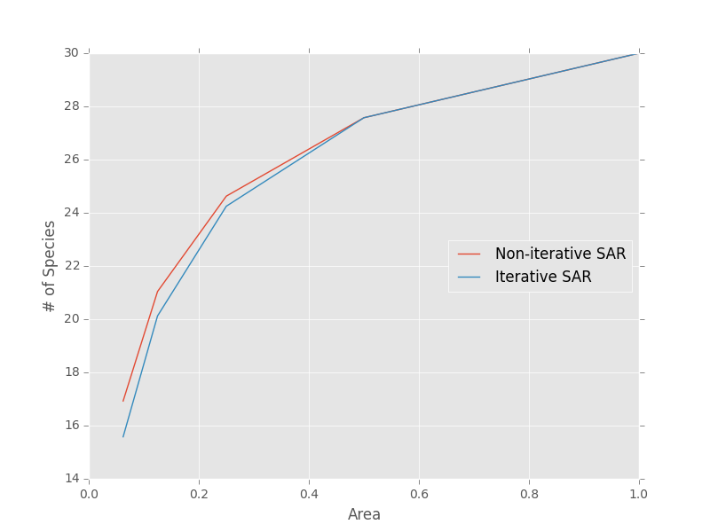

We can generate sampling EARs with identical syntax

    >>> # Get a sampling EAR
    >>> meco.models.sampling_ear.vals(areas, S0, N0, 1, 1)
    array([ 30.        ,   2.42629621,   0.42783611,   0.14823899,   0.06399121])

The METE SAR/EAR (`mete_sar`, `mete_sar_iterative`, 'mete_ear') is a special case of the sampling SAR where `sad_k = 0` (Logseries SAD) and `ssad_k = 1` (truncated geometric SSAD). This SAR that is described at length in the book **Maximum Entropy and Ecology: A Theory of Abundance, Distribution, and Energetics** by John Harte (2011). Just like the general sampling SAR/EAR, it can be used to upscale and downscale species richness, but only requires two parameters: total species at the base area (`S0`) and total individuals at the base area (`N0`).

    >>> # Non-iterative METE SAR
    >>> areas = [1, 0.5, 2, 0.25, 0.125, 4]
    >>> meco.models.mete_sar.vals(areas, S0, N0)
    array([ 30.        ,  24.35087775,  36.15434332,  19.76518824,
        15.76150633,  41.73194557])

    >>> # Iterative METE SAR
    >>> meco.models.mete_sar_iterative.vals(areas, S0, N0)
    array([ 30.        ,  24.35087775,  36.15434332,  19.25568734,
        14.76483053,  42.77067166])

The METE EAR is called with identical syntax

    >>> # Get the METE EAR
    >>> areas = [1, 0.9, 0.7, 0.2, 0.001]
    >>> meco.models.mete_ear.vals(areas, S0, N0)
    array([  3.00000000e+01,   2.22524222e+01,   1.15798199e+01,
         1.44475285e+00,   5.79588423e-03])

Additional subpackages
=========================

In addition to the `models` package, the ``macroeco`` package contains two other main subpackages of interest:

* `empirical` - loads data tables and performs empirical analysis of macroecological metrics, such as the species abundance distribution and species area relationship (:doc:`empirical`)

* `compare` - provides utility functions for comparing the fit of models to empirical metrics, such as AIC weights and r-squared statistics (:doc:`compare`)

A common workflow involves loading data, calculating an empirical metric, fitting one or more models to the empirical metric, and evaluating the fit of the model to the metric.

A simple species abundance distribution analysis
================================================

The following example shows a simple species abundance distribution analysis for the demo ANBO data that can be downloaded `here <https://github.com/jkitzes/macroeco/releases/>`_ by clicking on the `demo_files_ANBO.zip` under the latest version.

First, the ``Patch`` class from the empirical subpackage is used to create a Patch object that holds the data table and a metadata dictionary describing the data. ``Patch`` requires a path, absolute or relative, to a metadata file as a mandatory argument (see :ref:`own-data` for information on creating a metadata file for a new data set).

    >>> pat = meco.empirical.Patch('~/Desktop/ANBO.txt')

The data table can be accessed by the via the `table` attribute of the `Patch` object

    >>> pat.table
         year  cell  row  column     spp  count
    0    2010     1    3       3    cabr      3
    1    2010     1    3       3  caspi1     20
    2    2010     1    3       3    crcr      3
    3    2010     1    3       3   crsp2      1
    4    2010     1    3       3    gnwe     11
    5    2010     1    3       3   grass     11
    6    2010     1    3       3   lesp1      1
    7    2010     1    3       3    phdi      5
    8    2010     1    3       3    pypo      6
    9    2010     1    3       3    ticr     50
    10   2010     2    3       2  caspi1     17
    11   2010     2    3       2   comp1      2
    12   2010     2    3       2   crsp2      7
    13   2010     2    3       2    gnwe      4
    14   2010     2    3       2   grass     26
    15   2010     2    3       2    phdi      7
    16   2010     2    3       2    pypo      8
    17   2010     2    3       2    ticr     12
    18   2010     2    3       2   unsp1      1
    19   2010     3    3       1   arsp1      1
    20   2010     3    3       1  caspi1      9
    21   2010     3    3       1   crsp2      8
    22   2010     3    3       1   grass    120
    23   2010     3    3       1    mobe      4
    24   2010     3    3       1    phdi     14
    25   2010     3    3       1    pypo     12
    26   2010     3    3       1    ticr      7
    27   2010     3    3       1   unsp1      1
    28   2010     4    3       0    crcr     23
    29   2010     4    3       0   crsp2     13
    ..    ...   ...  ...     ...     ...    ...
    [121 rows x 6 columns]

The `empirical` subpackage contains a number of functions that operate on patch objects and return macroecological metrics. Here we'll use the function ``sad`` to calculate a species abundance distribution. The function ``sad`` has the following arguments

1. The first argument is a `Patch` object

2. The second is a string specifying which column in the data table has the species names (i.e. the `spp_col`) and which, if any, has a count of individuals at a particular location (i.e. the `count_col`). For this data set, the column containing species names is `spp` and the column containing counts is `count`. Therefore, the string would read `'spp_col:spp; count_col:count'`.

    **NOTE**: If `count_col` is not given the count at any given location is assumed to be 1.

3. The third is a string specifying how to split the data. We are leaving this argument blank (`''`) in this example but see :doc:`empirical` or later in the tutorial (:ref:`a-more-complex-example`) for more information on splitting.

We can then call the ``sad`` function as follows

    >>> sad = meco.empirical.sad(pat, 'spp_col:spp; count_col:count', '')

All functions for macroecological metrics return their results as a list of tuples. Each tuple has two elements

1. A string describing how the data were split (no split in this case)

2. A result table with a column ``y`` (for univariate distributions like the species abundance distribution) or columns ``y`` and ``x`` (for curves such as a species area relationship) giving the results of the analysis.

Since the data were not split in this example, the list has only one tuple.  The result is

    >>> sad
    [('',        spp     y
    0    arsp1     2
    1     cabr    31
    2   caspi1    58
    3     chst     1
    4    comp1     5
    5     cran     4
    6     crcr    65
    7    crsp2    79
    8     enfa     1
    9     gnwe    41
    10   grass  1110
    11   lesp1     1
    12    magl     1
    13    mesp     6
    14    mobe     4
    15    phdi   210
    16   plsp1     1
    17    pypo    73
    18    sasp     2
    19    ticr   729
    20   unsh1     1
    21   unsp1    18
    22   unsp3     1
    23   unsp4     1)]

where the first element of the tuple is `''` (an empty string because no split occurred) and the second element in the tuple is a `pandas` DataFrame with two columns: 1) the species ID (`spp`) and 2) the abundance of each species (`y`).  The DataFrame itself can easily be extracted

    >>> sad_df = sad[0][1]

where we recognize that the DataFrame is the second element (index 1) of the first tuple in the list (index 0).  This notation will make more sense when we consider splitting the data below (:ref:`a-more-complex-example`).

Any number of distributions from the `models` subpackage can be fit to the resulting empirical metric. The code below fits a Fisher's logseries distribution and uses the function ``AIC`` from the compare subpackage to calculate the AIC for this distribution and data.

    >>> # Fit the logseries distribution to the empirical SAD
    >>> p = meco.models.logser.fit_mle(sad_df['y'])
    >>> p
    (0.9984913251355505,)

We can then get an AIC value to determine the "goodness of fit" of the logseries distribution to the empirical data.

    >>> # Get the AIC value
    >>> logser_aic = meco.compare.AIC(sad_df['y'], meco.models.logser(p[0]))
    >>> logser_aic
    206.2729258353742

If you are using the `ipython` environment you can see the arguments that meco.compare.AIC takes using `meco.compare.AIC?`.  In short, the function takes in the data (in this case the species abundance distribution) and fitted model object and returns the AIC value.  Of course, AICs aren't very useful by themselves, so let's compare the logseries fit to a broken stick distribution, another classic theoretical SAD.  This is equivalent to a zero-truncated negative binomial distribution with aggregation parameter `k` equal to 1.

    >>> # Get Broken Stick AIC
    >>> broken_stick_aic = meco.compare.AIC(sad_df['y'], meco.models.nbinom_ztrunc(np.mean(sad_df['y']), 1))
    >>> broken_stick_aic
    274.27490655552322

We can see that the lower AIC for the logseries suggests that this is a more appropriate model for this SAD.

We could also visually compare these models using their rank abundance distributions.  We first generate the rank abundance distributions for the fitted logseries and the broken stick distributions and then plot it against the empirical data.

    >>> logser_rad = meco.models.logser.rank(len(sad_df), p)
    >>> broken_stick_rad = meco.models.nbinom_ztrunc.rank(len(sad_df), np.mean(sad_df['y']), 1)

    >>> # Plot the empirical data. Note that [::-1] reverses the order of a vector
    >>> ranks = np.arange(1, len(sad_df['y']) + 1)
    >>> plt.semilogy(ranks, np.sort(sad_df['y'])[::-1], label="Empirical RAD")

    >>> # Plot the RAD of the models
    >>> plt.semilogy(ranks, logser_rad[::-1], label="Logseries RAD")
    >>> plt.semilogy(ranks, broken_stick_rad[::-1], label="Broken Stick RAD")
    >>> plt.xlabel("Rank")
    >>> plt.ylabel("Log(Abundance)")
    >>> plt.legend()
    >>> plt.show()

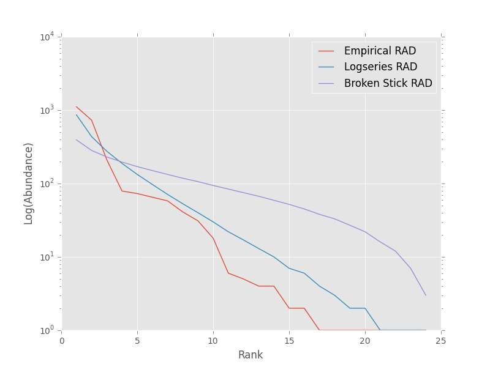

A simple species-area relationship analysis
===========================================

We can also analyze species-area relationships (SAR)s using `macroeco`. To get an empirical SAR from the ANBO data we use the function `meco.empirical.sar`.  As described in the documentation, this function takes 4 key arguments

1. `patch`: The empirical `Patch` object

2. `cols`: A semicolon-separated column string that identifies the species column (i.e. `spp_col`, the column containing the species names), the count column (i.e. `count_col`, the column containing the species counts at a particular location), the x column (i.e. `x_col`, the column specifying the spatial location of an individual in the x direction),  and the y column (i.e. `y_col`, which column specifying the spatial location of an individual in the y direction).  For example, this string for the ANBO data would be `'spp_col:spp; count_col:count; x_col:row; y_col:column'` because the column that contains the species names is `spp`, the column that contains the counts is `count`, the column that contain the spatial location of an individual in the x direction is `row` and the column that contains the spatial location of an individual in the y direction is `column`.  For the SAR analysis, `x_col` and `y_col` must be specified.

3. `splits`: A string specifying whether the analysis should be run on different subsets of the data. For example, if one had a column `year` specifying different years that the community census was completed the string `year:split` would run the analysis on each year separately. `split` is a key word described in the documentation.

4. `divs`: A semicolon-separated string that describes how to successively divide the patch along the `x_col` and `y_col` dimensions. For example, the string `'1,2; 2,2; 2,4'` will calculate the average species richness at three areas. The first areas (1,2) will be made by dividing the x column into 1 equal part and the y column into 2 equal parts.  The second areas (2, 2) will be made by dividing the x column and the y column into 2 equal parts.  The third areas (2, 4) will be made by dividing the x column in 2 equal parts and the y column in 4 equal parts.

To illustrate this dividing, let's look at the ANBO plot. The ANBO census was performed on a 4m x 4m = 16 m^2 grid, as shown below

.. figure:: images/ANBO_grid.png
    :align: center
    :scale: 30 %

A division of (1, 2) gives two areas of size 8 m^2 by dividing the plot horizontally into two halves

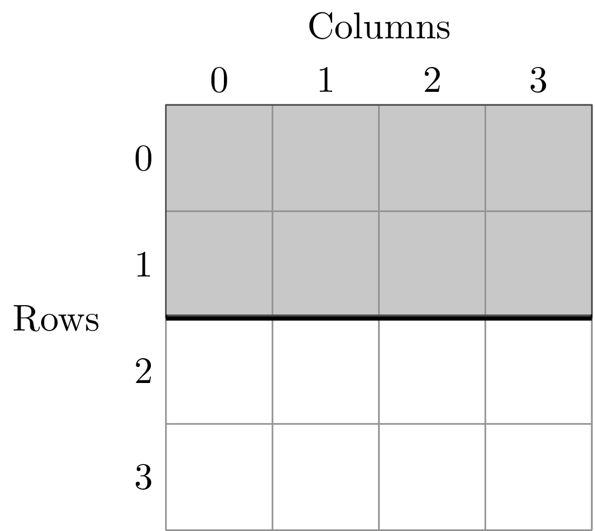

A division of (2, 1) gives two areas of size 8 m^2 by dividing the plot vertically into two halves

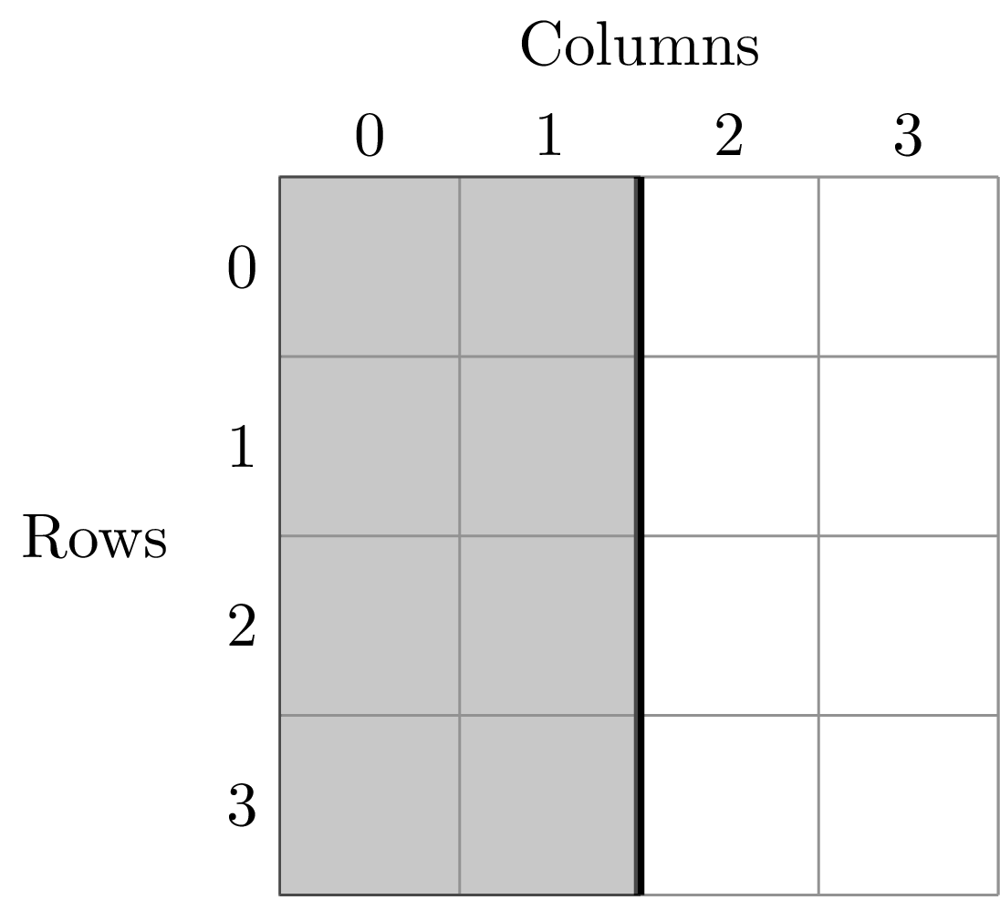

A division of (2, 2) gives four areas of size 4 m^2 by dividing the plot vertically and horizontally

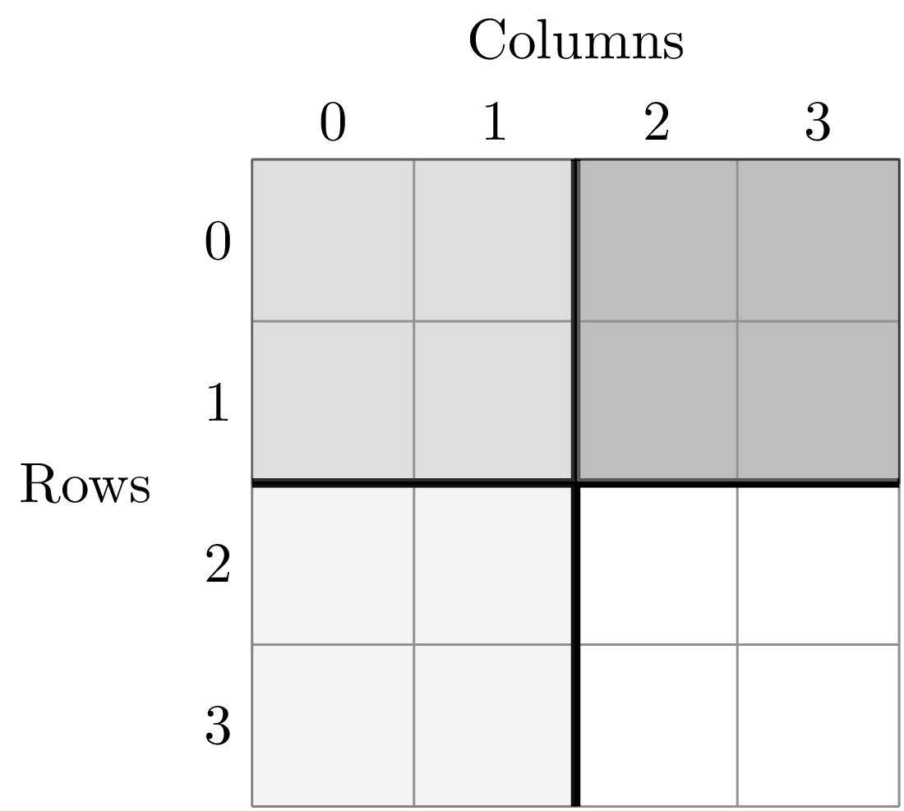

The get the SAR for the areas 1, 2, 4, 8, and 16 m^2 we use the following code.

    >>> sar = meco.empirical.sar(pat, 'spp_col:spp; count_col:count; x_col:row; y_col:column', "", "1,1; 1,2; 2,1; 2,2; 2,4; 4,2; 4,4")
    >>> sar
    [('',    div  n_individs    n_spp   x        y
      0  1,1   2445.0000  24.0000  16  24.0000
      1  1,2   1222.5000  18.5000   8  18.5000
      2  2,1   1222.5000  17.0000   8  17.0000
      3  2,2    611.2500  13.5000   4  13.5000
      4  2,4    305.6250  10.1250   2  10.1250
      5  4,2    305.6250  10.5000   2  10.5000
      6  4,4    152.8125   7.5625   1   7.5625)]

The output of the SAR function is a list of tuples where each tuple is a particular split.  Because we did not split the data (i.e. the `split` parameter was `''`), we have one tuple.  The second item in this tuple is a `pandas` DataFrame that contains the key results of the analysis

    >>> sar_table = sar[0][1]
    >>> sar_table
       div  n_individs    n_spp   x        y
    0  1,1   2445.0000  24.0000  16  24.0000
    1  1,2   1222.5000  18.5000   8  18.5000
    2  2,1   1222.5000  17.0000   8  17.0000
    3  2,2    611.2500  13.5000   4  13.5000
    4  2,4    305.6250  10.1250   2  10.1250
    5  4,2    305.6250  10.5000   2  10.5000
    6  4,4    152.8125   7.5625   1   7.5625

The column `div` gives the divisions specified in the function call. The column `n_individs` specifies the average number of individuals across the cells made from the given division. `n_spp` gives the average species across the cells made from the given division. `x` gives the absolute area of a cell for the given division. `y` gives the same information as `n_spp` and is included for easy plotting.

For example, the row with `div =  2,2` is a result of dividing the ANBO plot into 4 equal sized areas of 4 m^2, calculating the the species richness and total number of individuals in each of the 4 areas and returning the average species richness and total number of individuals over the four areas.

For plotting, one might want to combine like areas to a single value and then plot.

    >>> # Combine similar areas
    >>> combined_sar = sar_table.groupby('x').mean().reset_index()

    >>> # Plot the SAR
    >>> plt.loglog(combined_sar['x'], combined_sar['y'], '-o', label="Empirical SAR")
    >>> plt.xlabel("Log(Area)")
    >>> plt.ylabel("Log(Species)")

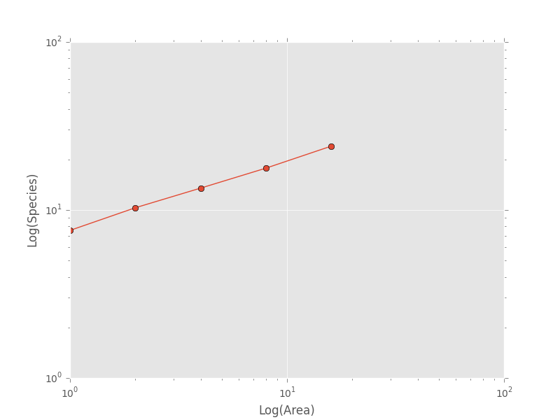

If we want to compare the empirical SAR to a power law SAR and a METE SAR we can first fit each of these curves to the data.  To fit the METE SAR, we only need the total number of species (`n_spp`) and total number of individuals (`n_individs`) at the base scale (i.e. at `div = 1,1`). We could either look at the table at see that `n_spp` at `div = 1,1` is 24 and `n_individs` is 2445 or pass in the data frame to the `fit_lsq` method of the `mete_sar` curve

    >>> # Fit the METE SAR
    >>> S0, N0 = meco.models.mete_sar_iterative.fit_lsq(sar_table)
    >>> S0, N0
    (24.0, 2445.0)

    >>> # Get the predicted values from the fitted METE SAR
    >>> pred_mete = meco.models.mete_sar_iterative.vals(combined_sar['x'][::-1], S0, N0, approx=True)

We can fit a power law SAR using similar notation

    >>> # Fit the power law
    >>> c, z = meco.models.power_law.fit_lsq(combined_sar['x'], combined_sar['y'])
    >>> c, z
    (7.617934680879773, 0.41241825356358003)

    >>> # Get the predicted value from the fitted power law
    >>> pred_power_law = meco.models.power_law.vals(combined_sar['x'][::-1], c, z)

and then compare these theoretical SARs to the empirical SAR

    >>> plt.loglog(combined_sar['x'][::-1], pred_power_law, '-o', label="Power Law SAR")
    >>> plt.loglog(combined_sar['x'][::-1], pred_mete, '-o', label="METE SAR")
    >>> plt.legend()
    >>> plt.show()

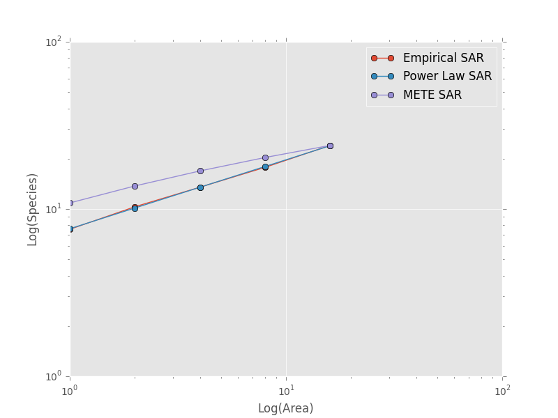

Clearly the power law SAR provides a better fit to the data than the METE SAR.  We can confirm this quantitatively using a one to one R^2 value when we compare observed (Empirical SAR) and predicted values (METE or Power Law SAR).  If the predicted SAR is a perfect fit to the observed SAR, the predicted values will exactly equal the observed values (i.e. fall along the one to one line).

    >>> r2_mete = meco.compare.r_squared(combined_sar['y'][::-1], pred_mete, one_to_one=True, log_trans=True)
    >>> r2_mete
    0.65340238146107854

    >>> r2_power_law = meco.compare.r_squared(combined_sar['y'][::-1], pred_power_law, one_to_one=True, log_trans=True)
    >>> r2_power_law
    0.99939083620342017

The R^2 for the power law is close to one and greater than the R^2 for the METE SAR supporting the plot that the power law is a better model for the SAR. Note that unadjusted R^2 values are not generally comparable across different models.

A simple spatial analysis
==========================

Another potential analysis we can do with `macroeco` is to analyze the spatial patterns of individuals in the plot. We can get the spatial patterns of all the species in plot by using the `meco.empirical.ssad` function.

The SSAD is a species-level spatial abundance distribution.  In other words, how are the individuals of a species distributed in space? The empirical SSAD function has three arguments. The first is the Patch object, the second is the `cols` string, and the third is the split string specifying how to grid a given landscape.

For example, the split string `'row:4; column:4'` says to divide the column `row` into 4 equally spaced sections and divide the column `column` into 4 equally spaced sections.  This gives a grid with 16 equally sized cells.

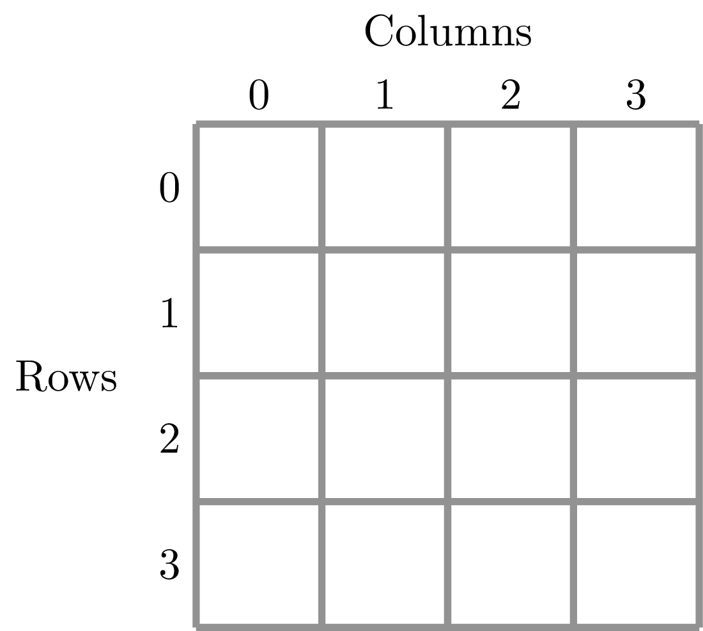

We can do this for the ANBO data using the following code

    >>> all_spp_ssads = meco.empirical.ssad(pat, 'spp_col:spp; count_col:count', 'row:4; column:4')

The result `all_spp_ssads` is a list with 24 tuples where each tuple contains two items.  The first item is a string giving a species name and the second item is a data frame giving the abundance of the given species in each of the 16 cells.

    >>> all_spp_ssads[0]
        ('arsp1',     y
     0   0
     1   0
     2   0
     3   0
     4   0
     5   0
     6   0
     7   0
     8   1
     9   0
     10  0
     11  0
     12  0
     13  1
     14  0
     15  0)

If we want to quantify the aggregation of each of these species in space, we can loop through all of the species in `all_spp_ssads` (24 of them) and fit a finite negative binomial distribution to each species.  A finite negative binomial distribution describes the probability of a single cell on the landscape having an abundance of 0-n where n is the total number of individuals in the species of interest.

The `k` parameter of this distribution specifies how aggregated a species is in space with `k` approaching 0 being very aggregated and `k` approaching infinity being binomially distributed.  Here is how we can fit the spatial distribution of each species in the landscape to a finite negative binomial distribution and extract the aggregation parameter `k` ::

    # Store the results
    agg_res = {}

    # Loop through all species
    for spp_name, data in all_spp_ssads:

        # Fit finite negative binomial distribution
        k_param = meco.models.cnbinom.fit_mle(data['y'], k_array=np.linspace(0.01, 5, num=1000))[1]

        # Get total abundance for a given species
        total_abund = data['y'].sum()

        # Store k parameter and total abundance for each species
        agg_res[spp_name] = (k_param, total_abund)

The dictionary `agg_res` contains the `k` parameter and total abundance for each species in the ANBO data.  If we wanted to see how `k` varied with abundance we could plot `k` versus abundance for each species ::

    # Extract k and abundance
    k, abund = zip(*list(agg_res.viewvalues()))

    # Get abundances greater than 20
    gt_20 = np.array(abund) > 20

    plt.semilogx(np.array(abund)[gt_20], np.array(k)[gt_20], 'o')
    plt.xlabel("log(Abundance)")
    plt.ylabel("k parameter")
    plt.show()

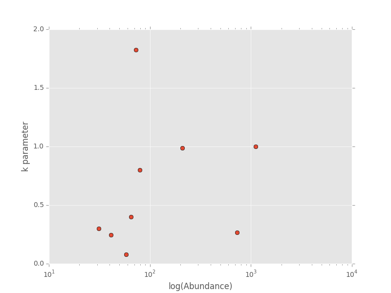

.. _a-more-complex-example:

A more complex analysis
=========================

One of the major benefits of `macroeco` is that you can explore how macroecological patterns vary across scale and/or for different subsets of your data. For example, what if we wanted to explore how an SAD changed across scale?  We will again use the ANBO data to illustrate this example.

Remember that the ANBO census was conducted on a 4m x 4m grid where each cell was 1m x 1m.  To examine how the SAD changes across scale, we will take the following steps.

First, split the ANBO plot on the `row` and `column` columns and get the empirical SAD for each of the resulting cells.  For example, if I split `row` into 2 equal halves and `column` into 4 equal halves I will get a plot that contains 8 cells of that are 2 m^2.

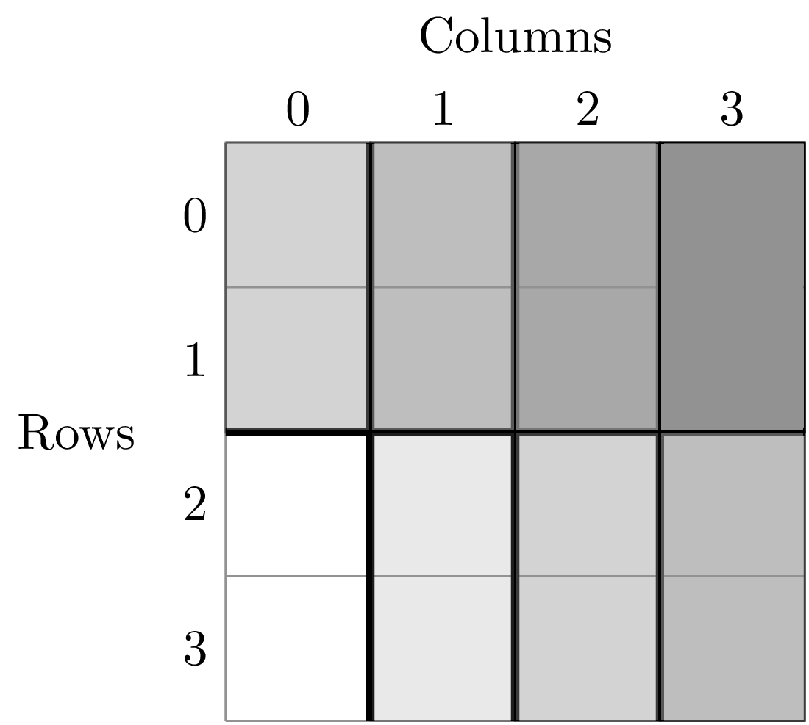

Each of these cells has a unique SAD.  I get these SADs using the following code

    >>> # Split row by 2, split column by 4
    >>> split_sads = meco.empirical.sad(pat, "spp_col:spp; count_col:count", splits="row:2; column:4")

`split_sads` is a list with 8 tuples and each tuple contains the empirical SAD for one of the 8 cells created by `splits`. For example,

    >>> split_sads[0]
    ('row>=-0.5; row<1.5; column>=-0.5; column<0.5',
           spp    y
     1    cabr    7
     3    chst    1
     5    cran    2
     6    crcr   13
     7   crsp2    7
     9    gnwe    5
     10  grass  130
     15   phdi   22
     16  plsp1    1
     17   pypo    4
     19   ticr  210
     23  unsp4    1)

The second item in this tuple is the empirical SAD for one of the 8 cells created by `splits`. The first item is a string that tells us that this is an SAD from the cell where row is greater than -0.5 and less than 1.5 and the column is greater than -0.5 and less than 0.5.  Here is the visual representation of that cell

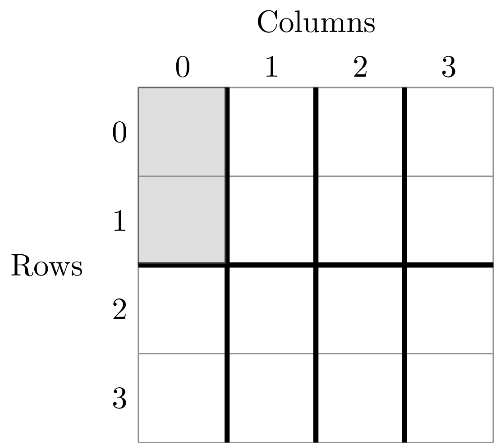

The second step is to fit a an theoretical SAD to the empirical SAD in each cell.  If we are interested in how the shape of the SAD changes with scale, we might want to fit a zero-truncated negative binomial distribution and look at the shape parameter of this distribution, `k` in each cell. We could then take the average of `k` across all SADs at that scale.

Third, we want to repeat this analysis across multiple scales

Here is the code to get the empirical SADs for 1m x 1m, 2m x 2m, 2m x 4m, 4m x 2m, and 4m x 4m scales. ::

    # Redefining the patch
    pat = meco.empirical.Patch("~/Desktop/ANBO.txt")

    # Get the empirical SAD in each 1m x 1m cell
    splits1 = "row:4; column:4"

    # Get the empirical SAD in each 2m x 1m cell
    splits2 = "row:2; column:4"

    # Get the empirical SAD in 4 2m x 2m cells (upper left , upper right, lower left, lower right)
    splits3 = "row:2; column:2"

    # Get the empirical SAD in left half and right half 4m x 2m cells
    splits4 = "row:1; column:2"

    # Get the SAD for the full plot
    splits5 = "row:1; column:1"

    all_splits = [splits1, splits2, splits3, splits4, splits5]

    # Store all the empirical SAD results
    results = []

    for split in all_splits:
        results.append(meco.empirical.sad(pat, 'spp_col:spp; count_col:count', splits=split))

The parameter `results` stores the empirical SAD results across scales. For example, `results[0]` is a list of length 16 that has the SAD for each cell in the plot.

    >>> len(results[0])
    16
    >>> results[0][0]
    ('row>=-0.5; row<0.5; column>=-0.5; column<0.5',       spp    y
     1    cabr    2
     3    chst    1
     5    cran    1
     6    crcr    3
     10  grass   42
     15   phdi    8
     16  plsp1    1
     17   pypo    3
     19   ticr  140
     23  unsp4    1)

Now we fit all the SADs to a zero-truncated negative binomial distribution and plot the results ::

    # Fit the SAD

    # Store the average ks
    avg_ks = []

    for tres, split_str in zip(results, all_splits):

        within_scale_ks = []

        for split in tres:

            within_scale_ks.append(meco.models.nbinom_ztrunc.fit_mle(split[1]['y'])[1])

        avg_ks.append(np.mean(within_scale_ks))

    # Plot the results
    areas = [1, 2, 4, 8, 16]
    plt.plot(areas, avg_ks, '-o')
    plt.xlabel("Scale/Area in m^2")
    plt.ylabel("k of zero-truncated NBD")
    plt.show()

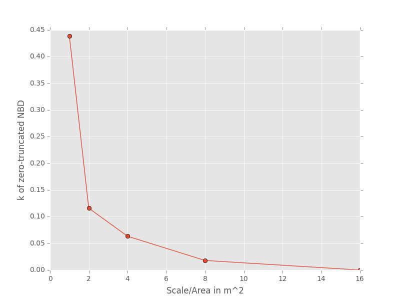

For this data, `k` is clearly decreasing with increasing scale.

